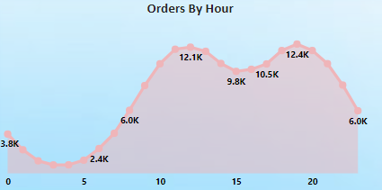

# Meriskill_Sales_Analysis_Project

## Project Overview and Purpose
This Sales Data Analysis project focuses on uncovering insights from sales data to guide business decisions. By analyzing trends, identifying best-selling products, and calculating revenue metrics, this project demonstrates data analysis skills critical for optimizing sales strategies.
In this analysis, I will:
- Examine sales trends over time, looking at monthly and seasonal patterns.
- Identify top-selling products to help prioritize inventory and marketing.
- Calculate key revenue metrics such as total sales.
- Create visualizations to clearly communicate findings and support data-driven recommendations.
## Data Source
- This data was provided by Meriskill online internship.
## Tools Used
- This project was done by Power BI for analysis and creating simple sales dashboard.
## Analysis and Results

### Top 5 Products by Sales

These are the 5 top selling products:
1. Macbook Pro Laptop.
2. iPhone.
3. ThinkPad Laptop.
4. Google Phone.
5. 27in 4K Gaming Monitor.

### Top 5 Products by quantity ordered

These are the 5 top Ordered Products by quantity:
1. AAA Batteries (4-Pack).
2. AA Batteries (4-Pack).
3. USB-C Chargine Cable.
4. Lightning Charging Cable.
5. Wired Headphones.

### Sales by City

These are the ranking of cities by sales:
1. San Francisco.
2. Los Angeles.
3. New York City.
4. Boston.
5. Atlanta.
6. Dallas.
7. Seatlle.
8. Portland.
9. Austin.

### Sales by Month

`January to April:` Sales showed a steady growth from January to April which suggest a positive growth trend in first quarter of the year.

`May to September:` Sales started to decrease from May to Septmber which suggest a mid year drip which might be due to reduced demand.

`October to December:` There was a strong increase in end of year quarter (Q4) with highest peak in December, that suggest an in increase demand possibly due to holiday season.

- Lowest: January and September are the lowest points of the year.
- Highest: December  marks the highest monthly sales figure.
The data suggests that sales are highest at the end of the year and lower in mid-year, which could reflect typical consumer behavior around holidays and off-peak periods.
### Orders By Hours

`0-5 AM:` Sales start late at midnight with around 3.8K, and then drop till 5 Am, this could be due to inactivity of customers during these hours.

`6 AM -12 PM:` Sales starts to increase from 6 AM with 2.4 K untill reaching the highest peak of orders at 12 PM reaching 12.1K.

`1-3 PM:` After reaching th highest peak at 12 PM, there is a slight decline in sales reaching about 9.8K at 3 PM. This midday drop might be attributed to lunch breaks or a pause in shopping activities.

`4-7 PM:` Orders rise again reaching a second peak at 7 PM with 12.4k this is the highest activity period which could be do to customers shopping after work or in their leisure time.

`8-11 PM:` Orders start to decrease again dropping 6K at 11 PM.

- Peak Hours: The two main peak hours are at 12 PM and 7 PM which is at evening time.
- Low activity Hours: The lowest activity is in the early morning (0 - 5 AM) and late night (9 PM - 11 PM).
### Recomendations

